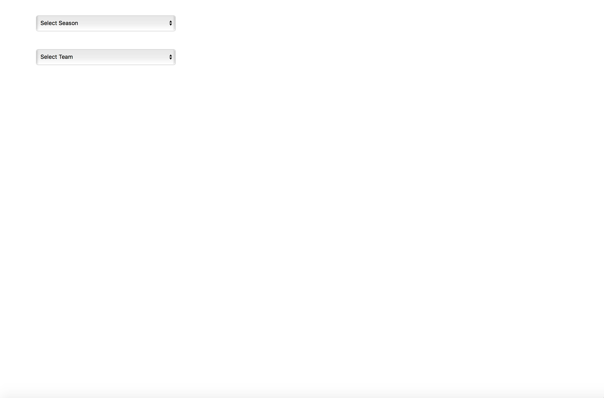
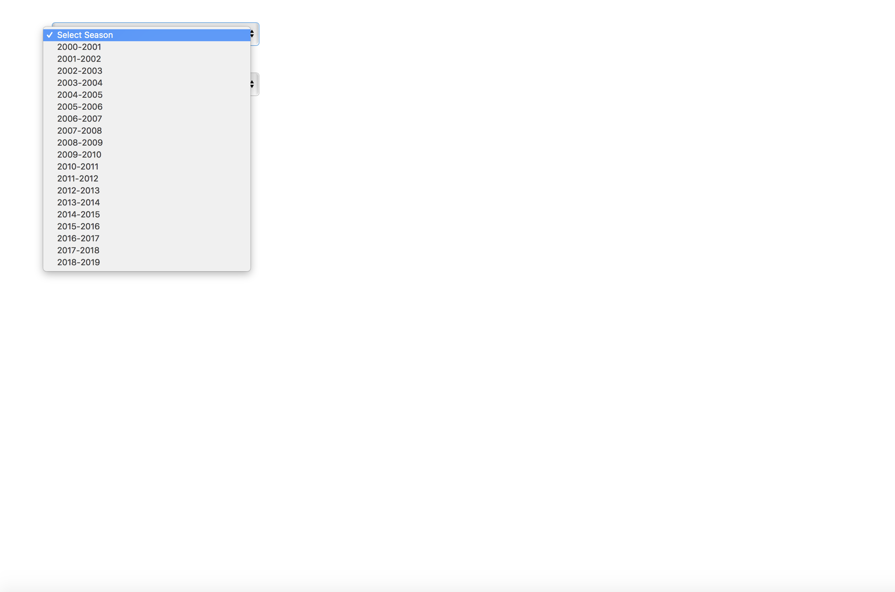
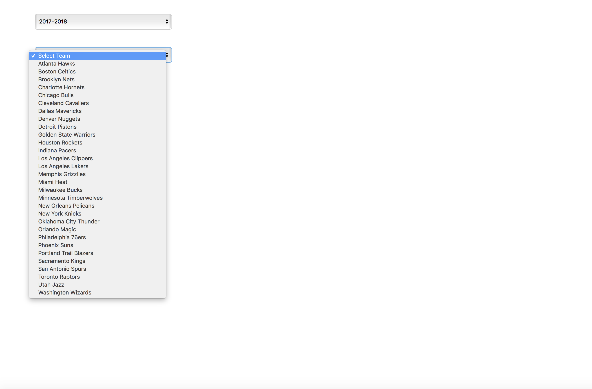
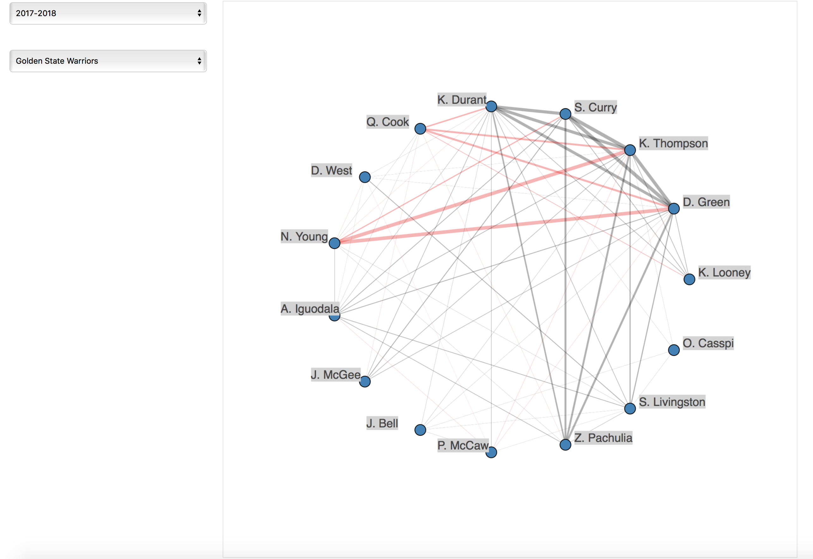
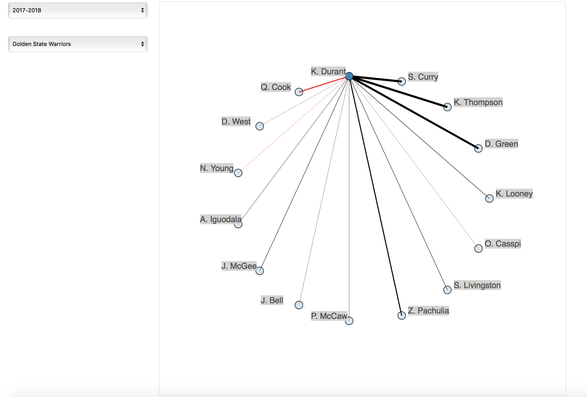

# Preliminary Bokeh Application

This repo implements [a previous analysis using NBA lineup data](https://github.com/douglaswlee/NBANetPointsNetwork) as an interactive Bokeh visualization, using the script `NBA_NetPts_Network.py`. This visualization allows a user to select a given season and then a team to produce the network graph from the previous analysis, starting from the 2000-01 season. Within the network graph, the user may also select a node corresponding to each player to highlight his estimated net points contributed while on the court with each teammate.

This script was developed and tested on a MacBook Pro running macOS High Sierra v10.13.1 and the following:

* `python 3.6.4`
* `pandas 0.22.0`
* `bokeh 0.12.13`
* `networkx 2.1`
* `beautifulsoup4 4.6.0`
* `requests 2.19.1`

#### Running

Fork and clone locally, then navigate to `NBA-Net-Point-Network` and execute the following command:  
`bokeh serve --show NBA_NetPts_Network.py`

Something like the following tab will load in your browser:

  

Then, click on the "Select Season" widget:

  

After, say, selecting the 2017-18 season, wait several seconds and then click on the "Select Team" widget:

  

Now after selecting a team (e.g., the Golden State Warriors), wait a bit, and we get our network graph of the 2017-18 Golden State Warriors:

  

We can click on a node corresponding to a player, e.g., Kevin Durant:

  

Note that there are still some issues to be ironed out with this visualization, which are to be determined as bugs with the code in `NBA_NetPts_Network.py` or with Bokeh's network graph rendering capabilities. In particular, some of the edge widths in the network graphs are not consistent with the actual edge widths which would be observed using only NetworkX. Additionally, the edge widths of specific edges may change depending on which player in the player pair is clicked. Hopefully, these issues will be ironed out soon enough.
